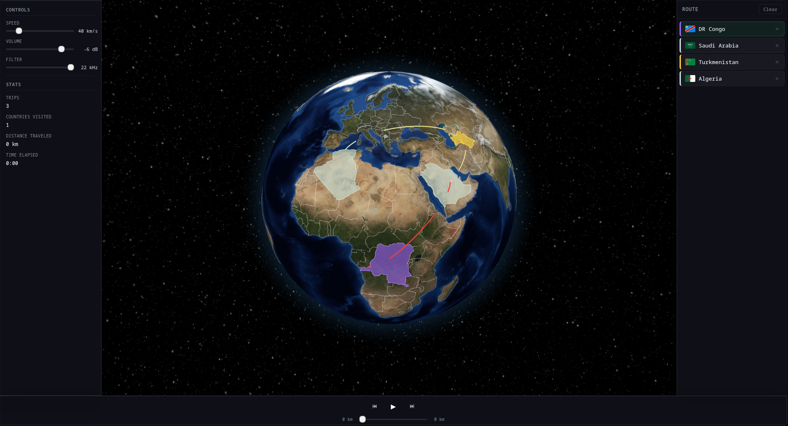
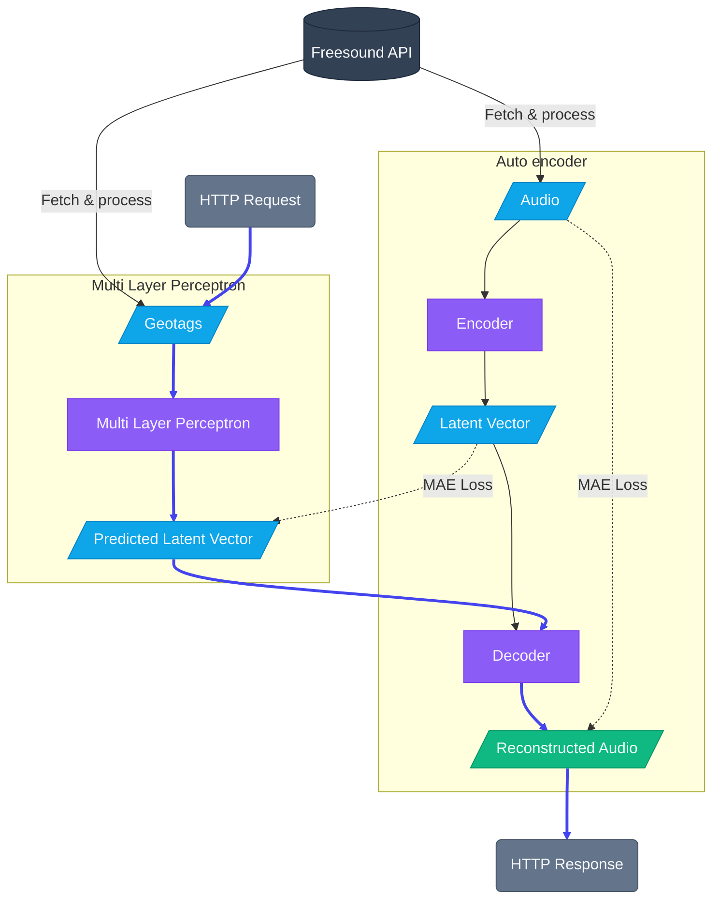

# GeoSynth



Sonification of geolocations using an Auto-encoder with data collected using [Freesound API](https://freesound.org/apiv2/apply). 

- Visit [GeoSynth](https://geosynth.vivekvjyn.xyz/)
- Click on countries on the globe to create a route
- Playhead moves along the route and feeds the co-ordinates to nueral network and produces sound.


## Pipeline


```mermaid
flowchart TD
    DB[(Freesound API)] -->|Fetch & process| A[/Audio/]
    DB -->|Fetch & process| G[/Geotags/]

    subgraph "Auto encoder"
      A --> EN[Encoder]
      EN --> LV[/Latent Vector/]
      LV --> DE[Decoder]
      DE --> RA[/Reconstructed Audio/]
      A -.->|MAE Loss| RA
    end

    subgraph "Multi Layer Perceptron"
      G --> MLP[Multi Layer Perceptron]
      MLP --> PLV[/Predicted Latent Vector/]
      PLV --> DE
      LV -.->|MAE Loss| PLV
    end
    
    HRQ(HTTP Request) --> G
    RA --> HRS(HTTP Response)

    linkStyle 9 stroke:#4444ef,stroke-width:3px
    linkStyle 7 stroke:#4444ef,stroke-width:3px
    linkStyle 8 stroke:#4444ef,stroke-width:3px
    linkStyle 11 stroke:#4444ef,stroke-width:3px
    linkStyle 5 stroke:#4444ef,stroke-width:3px
    linkStyle 12 stroke:#4444ef,stroke-width:3px
    
    style DB fill:#334155,stroke:#1e293b,color:#f8fafc
    style A fill:#0ea5e9,stroke:#0284c7,color:#f0f9ff
    style G fill:#0ea5e9,stroke:#0284c7,color:#f0f9ff
    style EN fill:#8b5cf6,stroke:#7c3aed,color:#f5f3ff
    style LV fill:#0ea5e9,stroke:#0284c7,color:#f0f9ff
    style DE fill:#8b5cf6,stroke:#7c3aed,color:#f5f3ff
    style RA fill:#10b981,stroke:#059669,color:#ecfdf5
    style MLP fill:#8b5cf6,stroke:#7c3aed,color:#f5f3ff
    style PLV fill:#0ea5e9,stroke:#0284c7,color:#f0f9ff
    style HRQ fill:#64748b,stroke:#475569,color:#f8fafc
    style HRS fill:#64748b,stroke:#475569,color:#f8fafc
```

## Run locally

**Clone repository**
```bash
git clone https://github.com/vivekvjyn/GeoSynth.git
git cd GeoSynth
```

**Setup**
```bash
conda create -n geosynth python=3.10 && conda activate geosynth
pip install -r requirements.txt
python flask run
```

## License
This project is licensed under the GNU General Public License. See the [LICENSE](LICENSE) for details.
