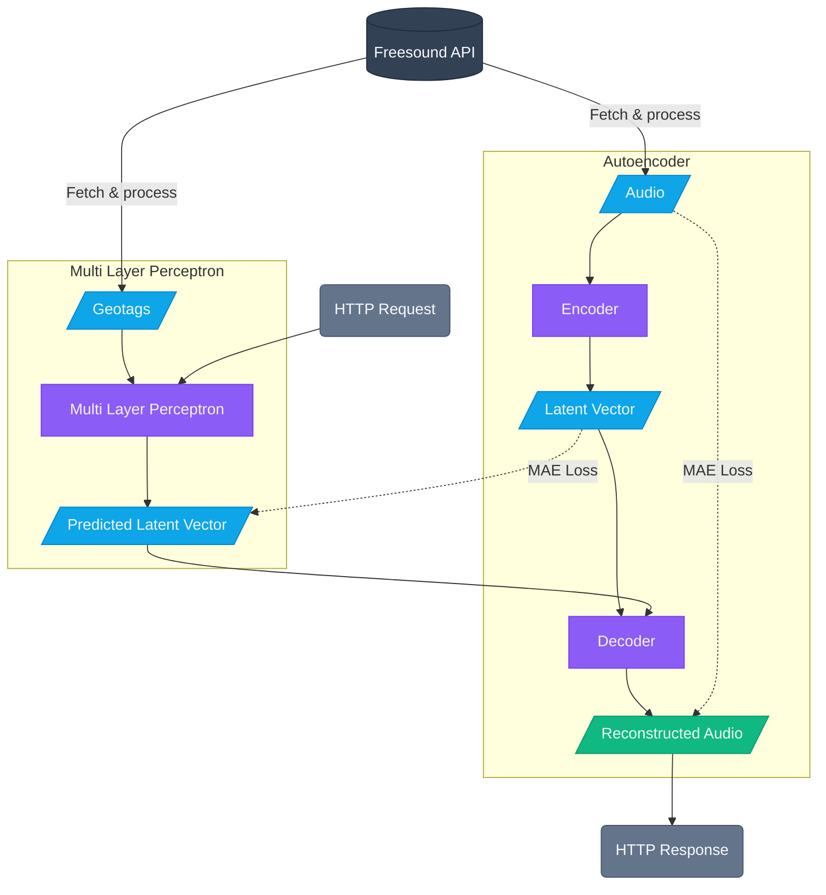
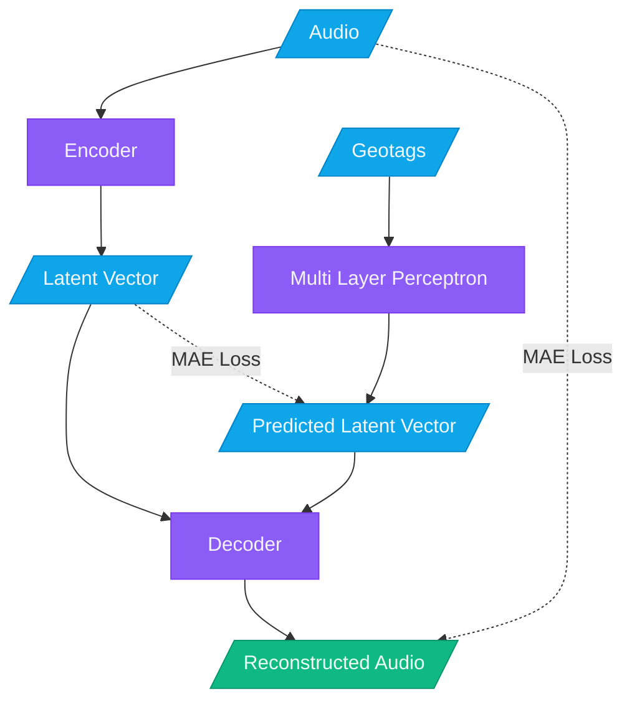
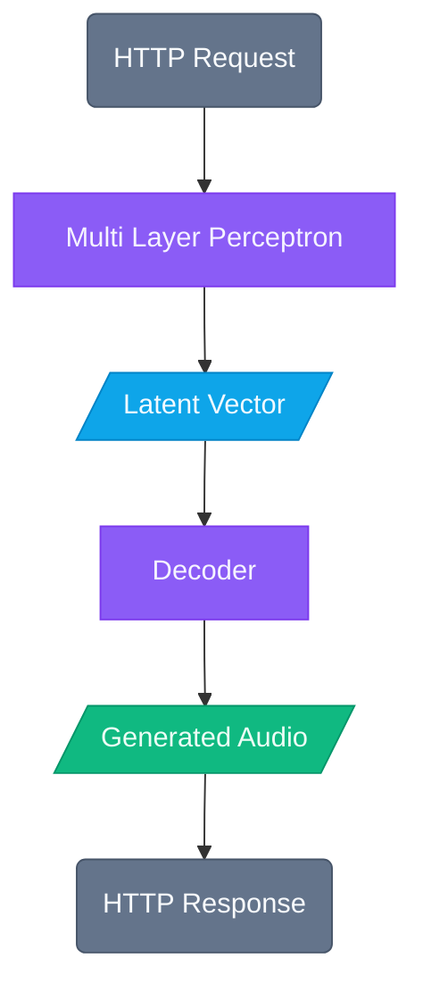

# GeoSynth — Architecture Diagrams

> Mermaid flowcharts for GitHub rendering. Notebook code cells cannot render mermaid
> directly, so the diagrams live here.

---

## Pipeline

---

## Training

---

## Inference

