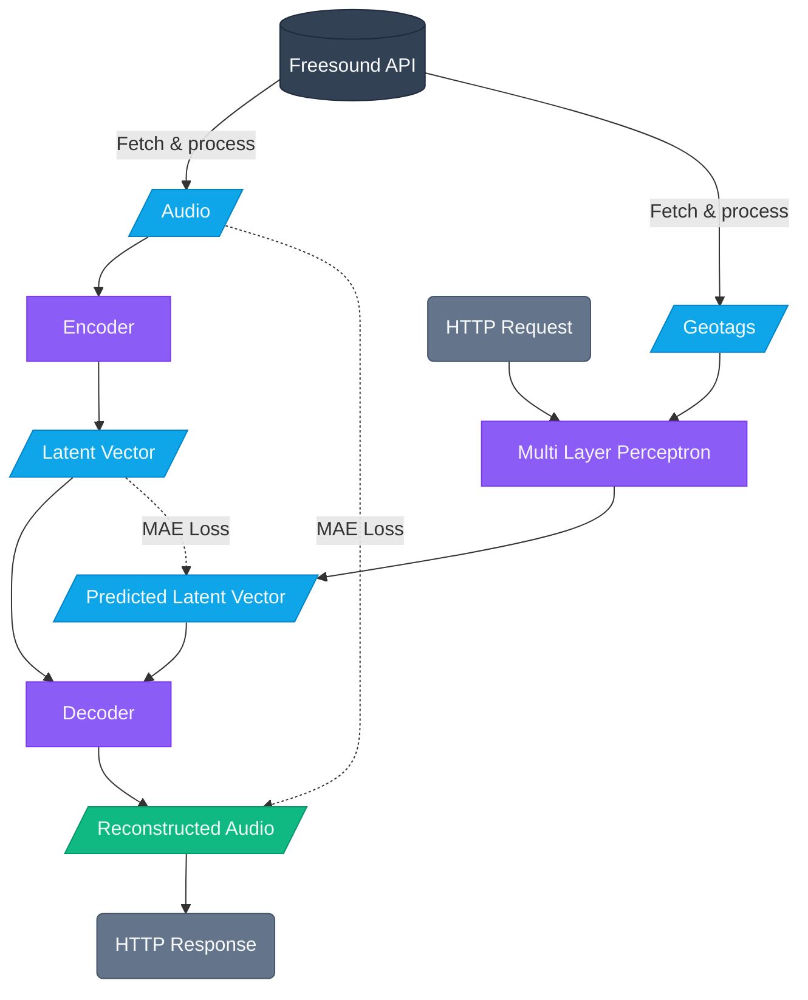

# Pipeline

```mermaid
flowchart TD
    DB[(Freesound API)] -->|Fetch & process| A[/Audio/]
    DB -->|Fetch & process| G[/Geotags/]
    
    A --> EN[Encoder]
    EN --> LV[/Latent Vector/]
    LV --> DE[Decoder]
    DE --> RA[/Reconstructed Audio/]
    A -.->|MAE Loss| RA
    
    G --> MLP[Multi Layer Perceptron]
    MLP --> PLV[/Predicted Latent Vector/]
    PLV --> DE
    LV -.->|MAE Loss| PLV
    
    HRQ(HTTP Request) --> MLP
    RA --> HRS(HTTP Response)
    
    style DB fill:#334155,stroke:#1e293b,color:#f8fafc
    style A fill:#0ea5e9,stroke:#0284c7,color:#f0f9ff
    style G fill:#0ea5e9,stroke:#0284c7,color:#f0f9ff
    style EN fill:#8b5cf6,stroke:#7c3aed,color:#f5f3ff
    style LV fill:#0ea5e9,stroke:#0284c7,color:#f0f9ff
    style DE fill:#8b5cf6,stroke:#7c3aed,color:#f5f3ff
    style RA fill:#10b981,stroke:#059669,color:#ecfdf5
    style MLP fill:#8b5cf6,stroke:#7c3aed,color:#f5f3ff
    style PLV fill:#0ea5e9,stroke:#0284c7,color:#f0f9ff
    style HRQ fill:#64748b,stroke:#475569,color:#f8fafc
    style HRS fill:#64748b,stroke:#475569,color:#f8fafc
```
